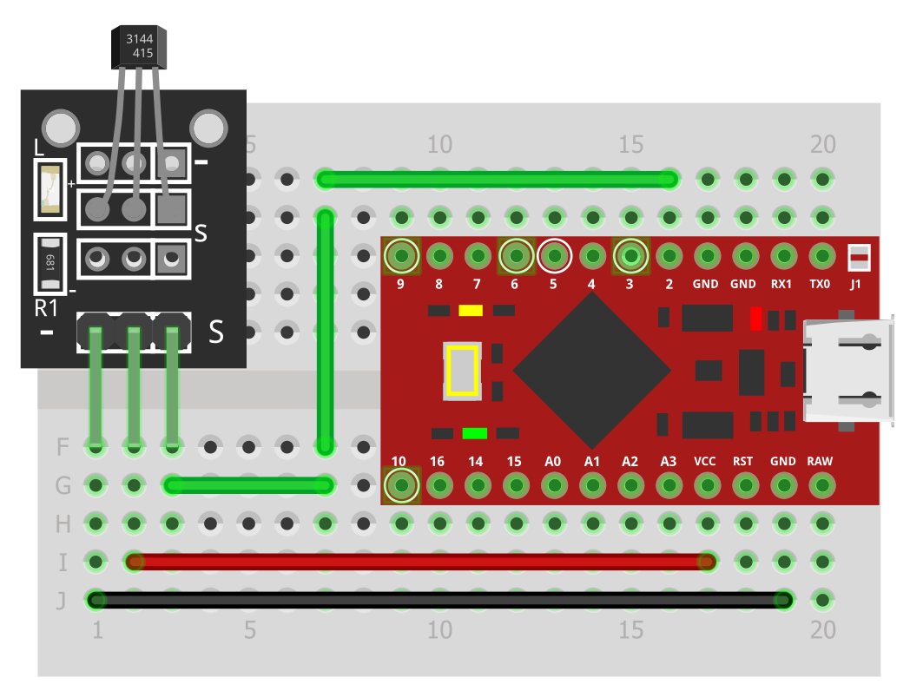
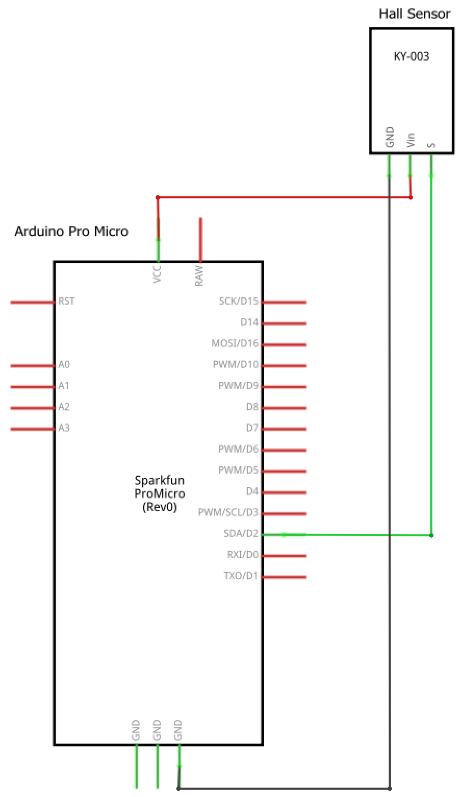
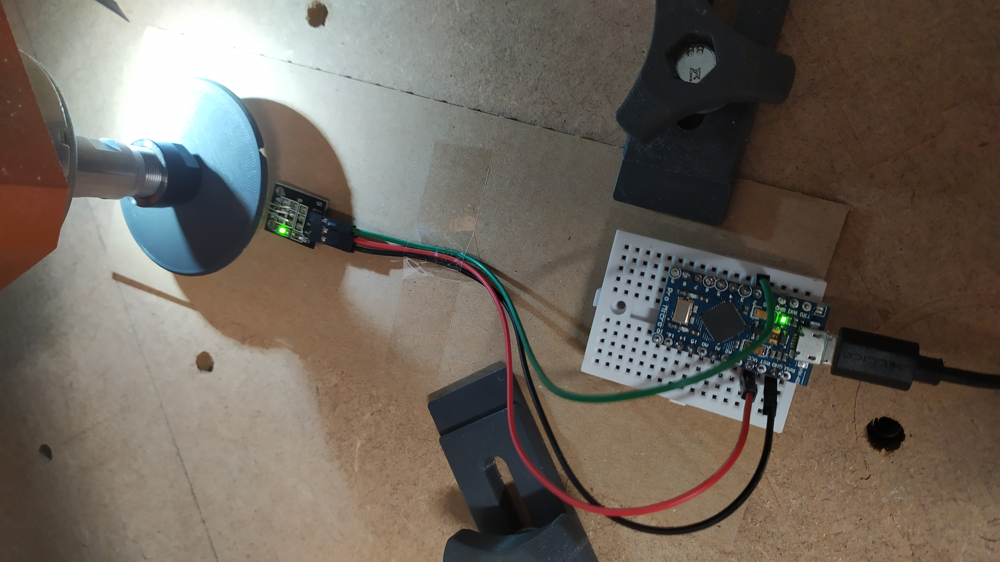
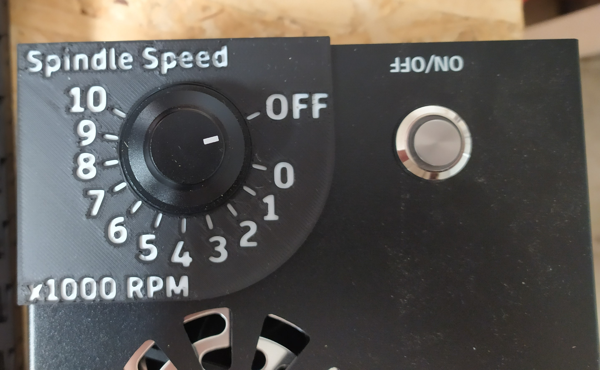
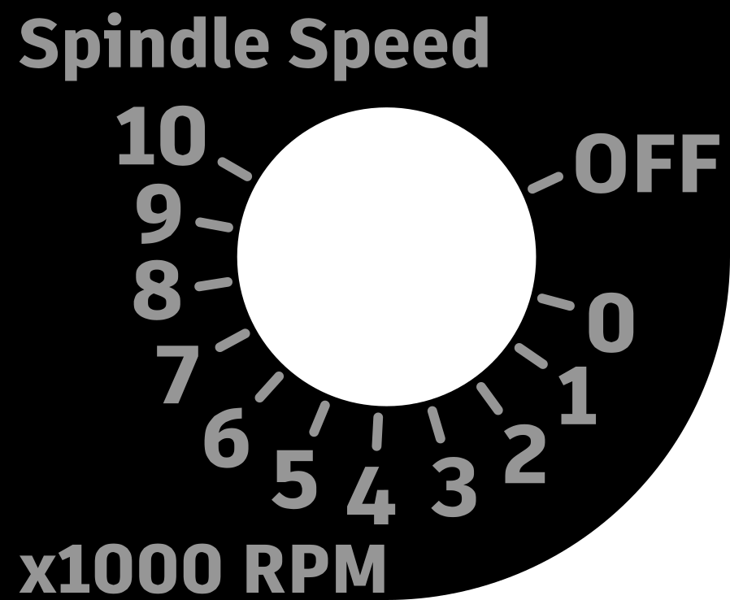

# Arduino Tachometer (RPM counter)

A rotation-per-minute counter using an Arduino (Pro Micro) board and a magnetic (Hall) sensor.

## Bill of Materials

- Arduino Pro Micro 5V (other 5V boards can work as well)
  - IMPORTANT: It must be a 5V board, because the sensor operates on this voltage level! 
- [KY-003 Hall Sensor](https://arduinomodules.info/ky-003-hall-magnetic-sensor-module/)
- Jumper wires
- M3×20 screw
- M3 nut
- 2 pieces of 8×3 magnet (8mm diameter, 3mm thick)

## How To Measure

First, create a rotating disk with magnets:

1. Print the `Tachometer Disk` model from the `3D Print` folder.

2. Insert the 2 magnets into the sockets on the disk. They should be snug fit, but you may want to cover them with tape for additional safety.

3. Insert the screw and the nut into the middle hole. It will function as a shaft.

4. Insert the shaft into the collet of the spindle you want to measure.

Second, build the measuring device:

1. Connect the Hall sensor to the Arduino:

Schematic:

2. Place the sensor close to the rotating magnets. When a magnet is close enough to the sensor the green led on the sensor board should turn on.

IMPORTANT: The sensor is directional, it can detect the magnetic field only on the side the text is written onto it!

Finally, run the code:

1. Open the code in the `Arduino` folder and upload it to the Arduino.

2. When the device boots it starts the measurement immediately and prints the results to the Serial Monitor window, so open Serial Monitor.

Enjoy :)

## Photos

## For FoxAlien Users

I used this tachometer to measure the 300W spindle on my FoxAlien Masuter Pro CNC. If you have the same machine you can 3D print the `Tachometer Gauge` from the `3D Print` folder:

Or you can use the SVG file in the `CNC` folder to cut it on your CNC:

## Acknowledgements

Thanks to InterlinkKnight for sharing his [Arduino Tachometer tutorial](https://www.youtube.com/watch?v=u2uJMJWsfsg).

## About the author

This project was created by [György Balássy](https://linkedin.com/in/balassy).